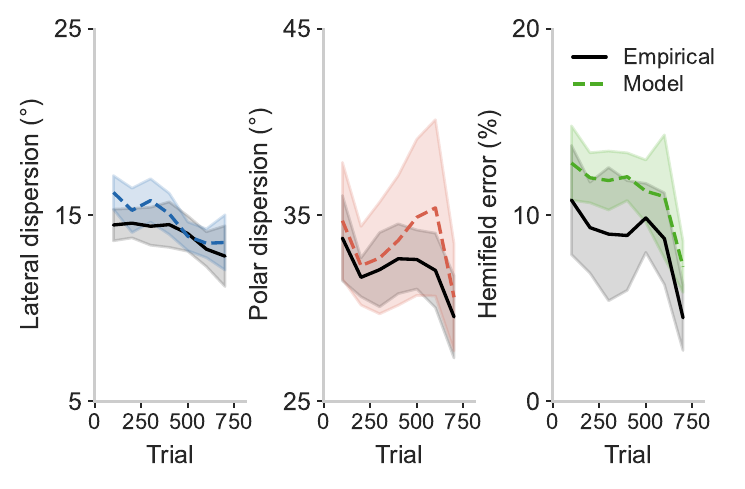

# Framing Spatial Hearing within the Free Energy Principle

Code for the IWAI 2026 extended abstract:

> Barumerli, R., Meyer-Kahlen, N., & Picinali, L. (2026). *Framing Spatial Hearing within the Free Energy Principle: A Hierarchical Model of Perceptual Learning.* International Workshop on Active Inference (IWAI 2026).

Sound-localisation learning with visual feedback is modelled as trial-by-trial belief revision under the free energy principle. Three beliefs are updated by natural-gradient descent: lateral precision, polar precision and hemifield disambiguation. Data: Majdak, Goupell & Laback (2010), manual-pointing group.



## Contents

- `MAIN_fep_simulation.ipynb`: model equations, fitting, Figure 3 and the R² values.
- `robustness_analysis.ipynb`: held-out model comparison, cos² robustness, bootstrap (Table 1 of the paper). About 20 minutes.
- `data/download_data.py`: downloads `data.mat` from the [AMT](https://amtoolbox.org) auxiliary data and checks its checksum.
- `figures/`: figures as in the paper.

## Run

```bash
conda env create -f environment.yml
conda activate iwai2026-fep
python data/download_data.py
```

Then run the notebooks. The optimiser (BADS) is stochastic, so numbers reproduce the paper up to optimiser noise.

## Data and licence

Data belong to Majdak, Goupell & Laback (2010), [doi:10.3758/APP.72.2.454](https://doi.org/10.3758/APP.72.2.454), distributed by AMT and only downloaded here. Code is MIT licensed.
